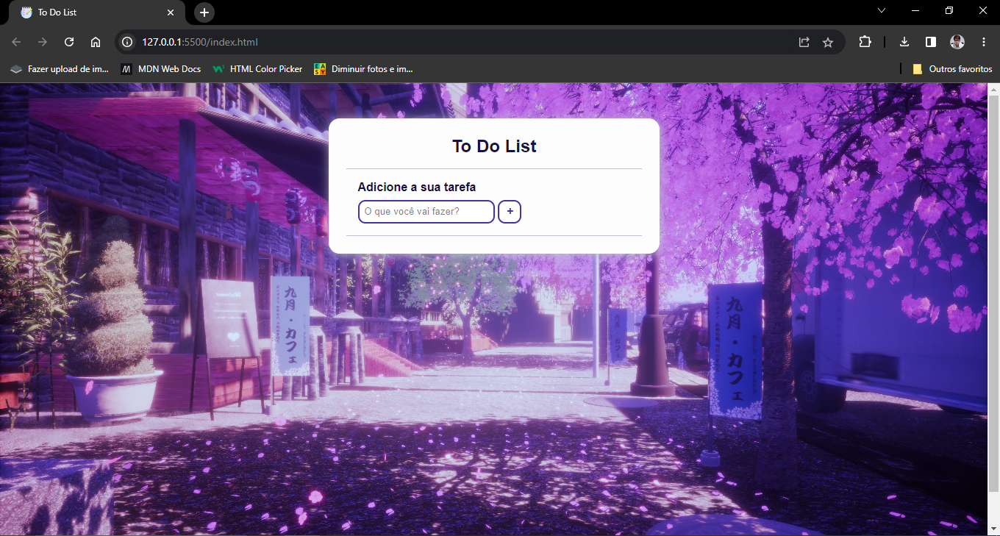
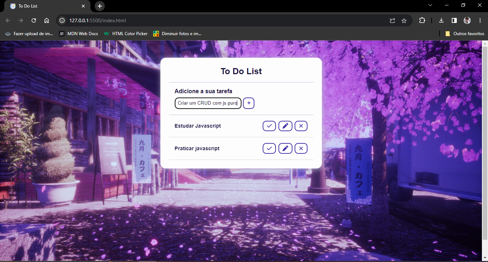
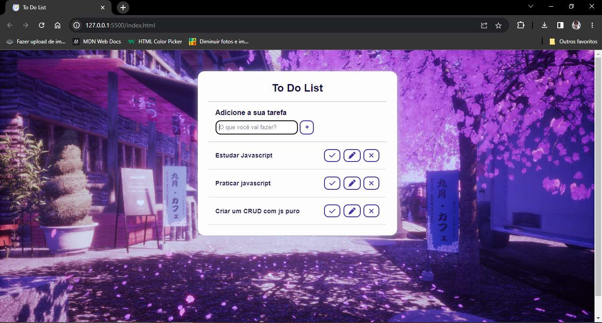
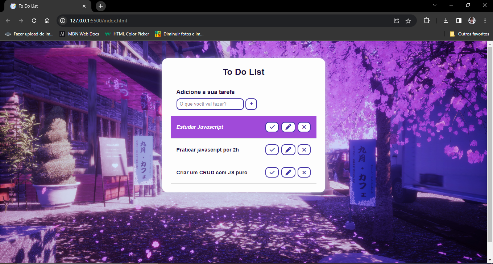

<h1 align = "center"> Olá, seja bem-vindo ao meu projeto. </h1>
 
<h2 align = "center"> Este é um To Do List feito somento com JavaScript</h2>
 

 Com esse To Do List você pode criar, editar, marcar como feitas e remover suas tarefas. Um To Do perfeito para o dia-a-dia.

 

 Abaixo você poderá ver algumas prints do projeto.

 
<h3 align = "center"> To Do List</h3>
 

 
<h3 align = "center"> To Do List com algumas tarefas adicionadas</h3>
 

 

 
<h3 align = "center"> To Do List com tarefas marcadas e editadas</h3>
 

